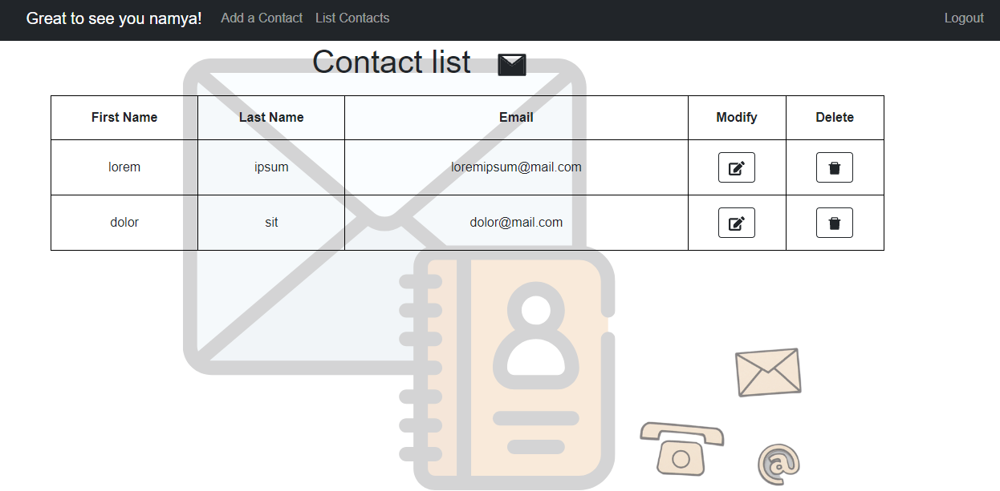

# Contact-o-email 

Contact-o-email is an application that allows you to organise your email contacts in a very easy manner.

The steps to use the application are : 
- Create an account if you are a New User else login to your account
- Add email contacts
- View a list of email contacts, modify or delete them

The  stack has been used to build this application

### Screenshots

The landing page has an option to sign-up or login

On succesful login, the user is redirected to the add contacts page

The contact list page has options to modify or delete records

The entire process can be represented as 

<image src="./assets/process.gif>raw=true" width="200"/>
